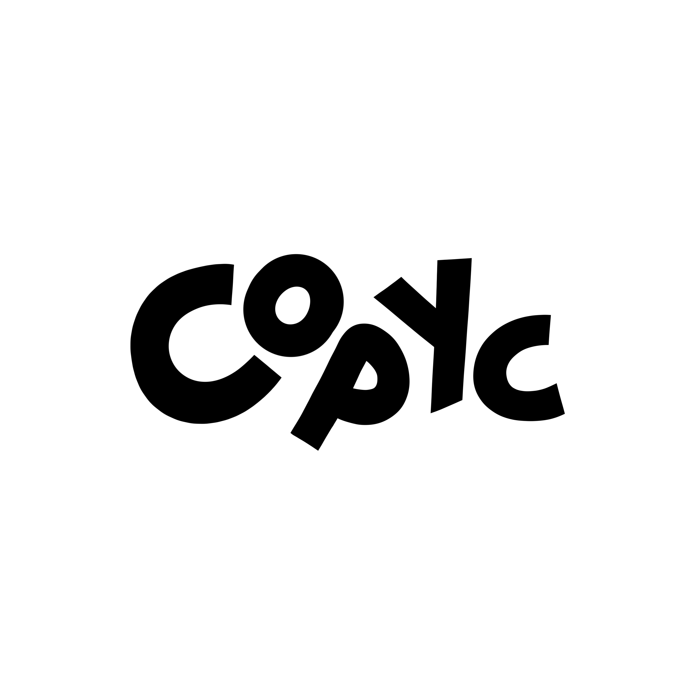
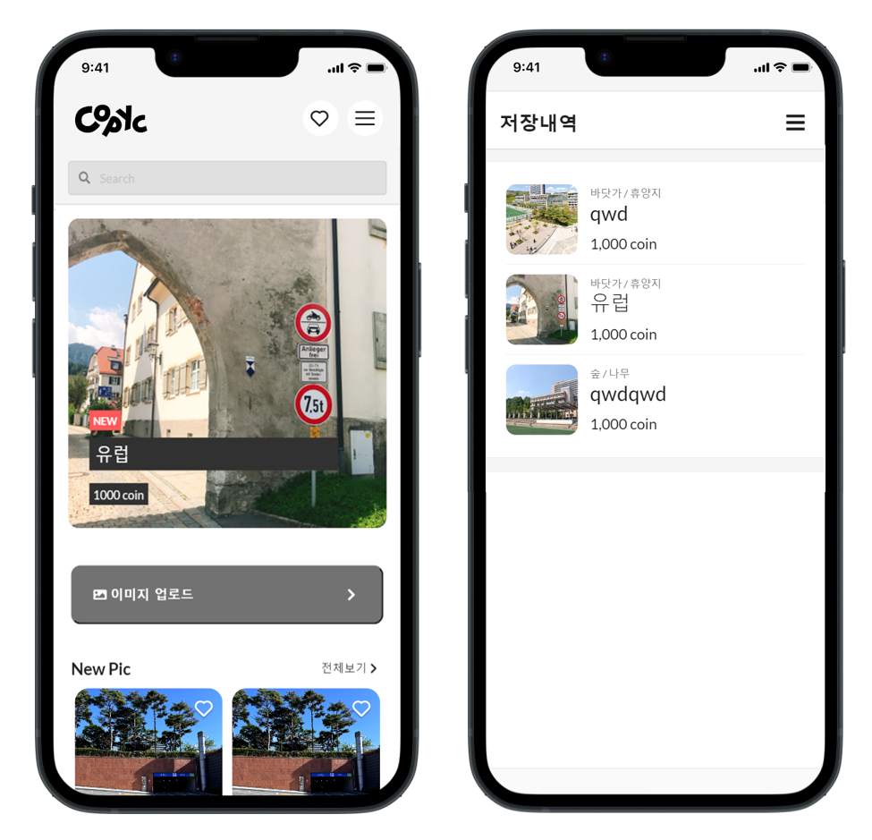
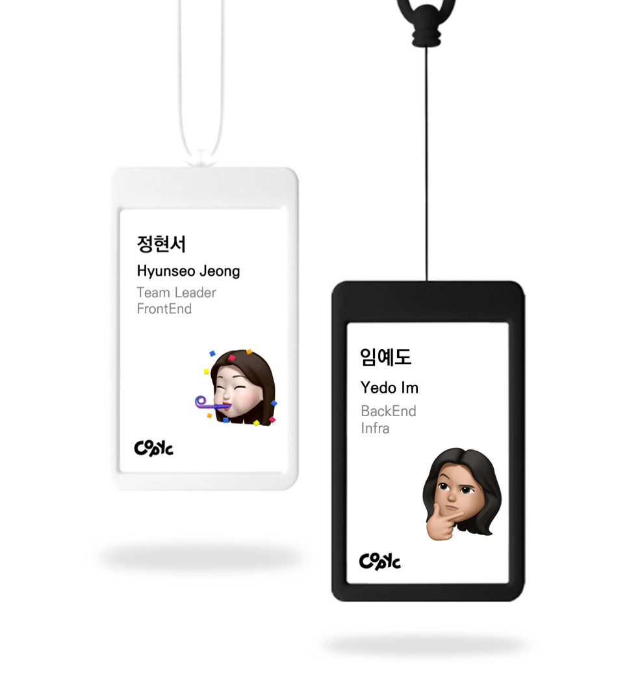
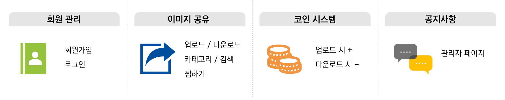
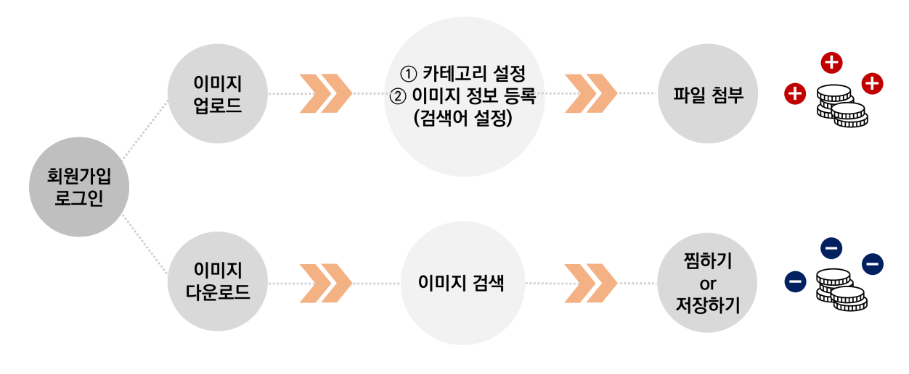
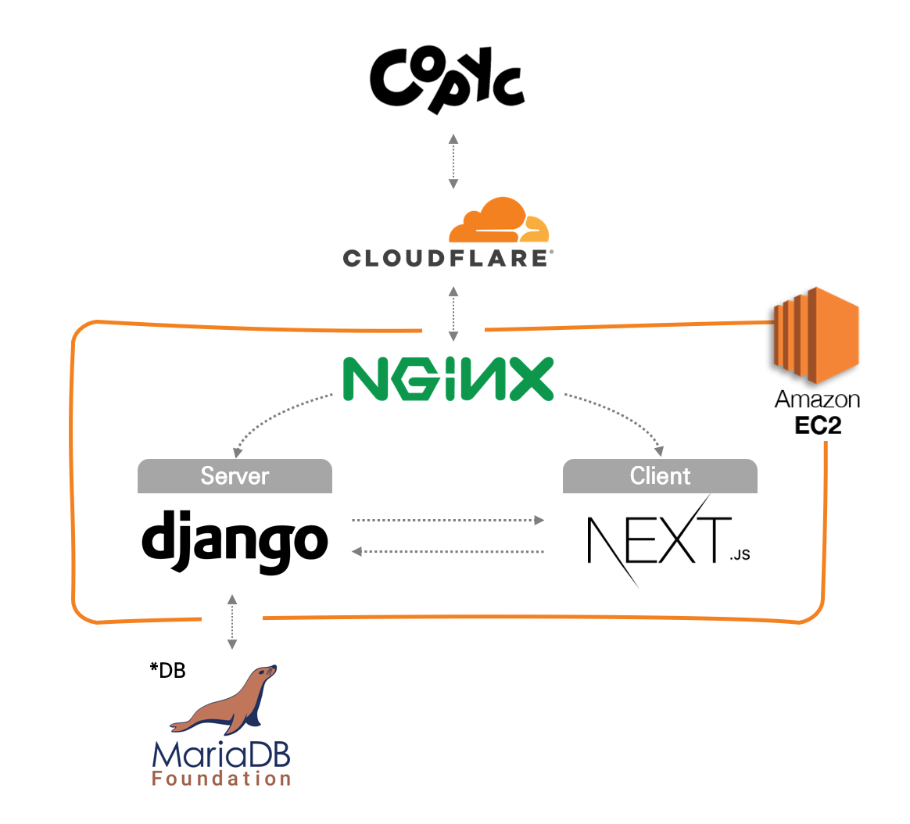

팀페이지 주소 : 2023년 12조 https://kookmin-sw.github.io/capstone-2023-12
<br/>

<div align=center>   
    
</div>
<br/>

<div align=center>
    
    
    
    
    
    
    
    
    
    
    
    
    
    
    
    


</div>
<br/>

## 목차

1. [프로젝트 소개](#1-프로젝트-소개)
2. [Abstract](#2-abstract)
3. [시연 영상](#3-시연-영상)
4. [팀 소개](#4-팀-소개)
5. [주요 기능](#5-주요-기능)
6. [시스템 구성도](#6-시스템-구성도)
7. [Document](#7-document)
<br/>

## 1. 프로젝트 소개

**Copyc**
> [카픽] : Copyright + Picture
> 


- 웹툰 작가들을 위한 이미지 공유 모바일 플랫폼
- 저작권 허용, 상업적 이용 OK


*Copyc은 웹툰 작가들을 위한 배경 트레이싱용 이미지 공유 모바일 웹 플랫폼입니다.*   
*Copyc에서 이미지를 업로드하고 코인을 얻어 원하는 이미지를 다운로드 받으세요!*   
<br/>

웹툰 이용자 1억 8,000만 시대.
우리는 웹툰 작가들의 작업 환경을 개선하고자 그들의 작업 방식에 주목했다.
많은 작가는 배경을 그릴 때 실제 사진을 대고 따라 그리는 '트레이싱' 기법을 사용한다.
그런데 인터넷 속 수많은 사진, 따라 그리기만 해도 '표절'이다.

우리는 바쁜 마감 일정 속에서도 어쩔 수 없이 직접 사진을 찍으러 나가야만 하는 작가들의 노동 시간을 단축하고자 한다.
우리가 함께 만들어 나갈 Copyc에서는 누구나 상업용으로 쓸 수 있는 직접 찍은 사진들을 공유한다.
항상 우리 주변에 있지만 사진으로는 잘 찍지 않는 길거리, 강의실, 영화관 사진 모두 웹툰 작가들에게는 소중한 자원이다.

서울 한복판에 사는 작가는 여러 건물의 모습을 공유할 것이다.
해운대 앞에 사는 작가는 바닷가 사진을 공유할 것이다.
제주도에 사는 작가는 제주도 곳곳의 아름다운 풍경들을 공유할 것이다.
Copyc에서 나누게 될 사진들은 누군가에게는 쓸모없을, 잘 찍었다고 할 수도 없는 사진들이겠지만 웹툰 작가들에게는 그들의 니즈에 꼭 맞는, 무엇보다도 필요했던 자원이 될 것이다.


- 서비스 이용 대상자
    - 웹툰 작가와 지망생, 그 외 일러스트레이터 등 저작권에서 자유로운 사진을 사용하고 싶은 누구나
<br/>

## 2. Abstract

**Copyc**
> Copyright + Picture
- Image Sharing Mobile Web Platform for Webtoon Writers
- Copyright allowed, commercial use OK

*Copyc is a mobile web platform for image sharing, specifically designed for webtoon artists who require background tracing images.   
With Copyc, you can upload images and earn coins to download the desired images!*   
<br/>

In an era where there are 180 million webtoon users, we have focused on improving the working environment for webtoon artists and their artistic process. Many artists use the technique of "tracing" by referencing actual photographs when drawing backgrounds. However, using random images from the internet for tracing purposes can be considered "plagiarism."

We aim to reduce the laborious task of webtoon artists, who often have to go out and take photos themselves, even amidst tight deadlines. Together, on Copyc, we share personally taken photographs that can be used for commercial purposes by anyone. Streets, classrooms, movie theaters, and other surroundings that we often overlook but are valuable resources for webtoon artists.

A webtoon artist living in the heart of Seoul will share the appearance of various buildings. An artist living near Haeundae will share beach photos. An artist residing in Jeju Island will share the beautiful landscapes found throughout the island. The photos shared on Copyc may be considered useless or poorly taken by some, but for webtoon artists, they will be valuable resources that perfectly meet their needs.

- Target audience for service:
    - Webtoon artists, aspiring artists, and other illustrators who want to use freely available photos without copyright restrictions.
<br/>

## 3. 시연 영상

[](https://youtu.be/vuvmn3MwAls)
<br/>

## 4. 팀 소개


- 정현서

```
* 학번: ****1693
* Role: Team Leader, FrontEnd
* E-mail: coraru@kookmin.ac.kr
```


- 임예도

```
* 학번: ****1682
* Role: BackEnd, Infra
* E-mail: ydim@kookmin.ac.kr
```
<br/>

## 5. 주요 기능 

<br/>


<br/>

## 6. 시스템 구성도

<br/>

## 7. Document
**중간 발표**
- [중간보고서](https://drive.google.com/file/d/12mVLmLgrs-cM3martpn90DJj2BWDxbky/view?usp=share_link)
- [중간발표자료](https://drive.google.com/file/d/1F9brloHz6PgaKsG11iMcyqmsTgwyOUM1/view?usp=share_link)
   
**최종 발표**
- [수행결과보고서]()
- [최종발표자료]()
- [포스터]()
