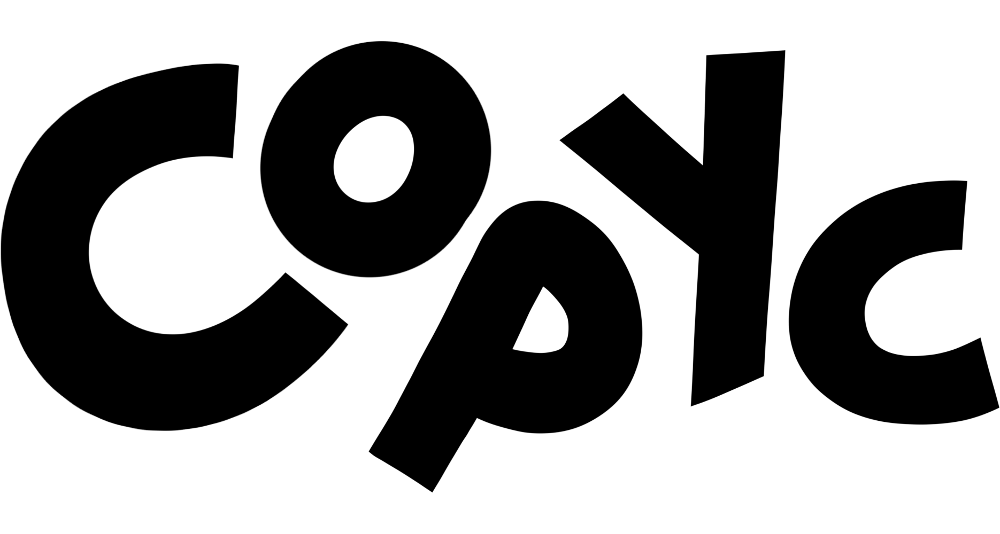

팀페이지 주소 : 2023년 12조 https://kookmin-sw.github.io/capstone-2023-12



## 목차

1. [프로젝트 소개](#-프로젝트-소개)
2. [Abstract](#-Abstract)
3. [소개 영상](#-소개-영상)
4. [팀 소개](#-팀-소개)
5. [사용법](#-사용)

## 1. 프로젝트 소개

**Copyc (카픽: Copyright + Picture)**

 

- 웹툰 배경 드로잉(트레이싱)을 위한 저작권 없는 이미지 공유 모바일 플랫폼
<br/></br>

웹툰 이용자 1억 8000만 시대.
우리는 웹툰 작가들의 작업 환경을 개선하고자 그들의 작업 방식에 주목했다.
많은 작가들은 배경을 그릴 때 실제 사진을 대고 따라 그리는 '트레이싱' 기법을 사용한다.
그런데 인터넷 속 수많은 사진들, 따라 그리기만 해도 '표절'이란다.

우리는 바쁜 마감 일정 속에서도 어쩔 수 없이 직접 사진을 찍으러 나가야만 하는 작가들의 시간을 단축하고자 한다.
우리가 함께 만들어나갈 Copyc에서는 누구나 상업용으로 쓸 수 있는 직접 찍은 사진들을 공유한다.
항상 우리 주변에 있지만 사진으로는 잘 찍지 않는 길거리, 강의실, 영화관 사진 모두 웹툰 작가들에게는 소중한 자원이다.

서울 한복판에 사는 작가는 여러 건물들의 모습을 공유할 것이다.
해운대 앞에 사는 작가는 바닷가 사진을 공유할 것이다.
제주도에 사는 작가는 제주도 곳곳의 아름다운 풍경들을 공유할 것이다.
Copyc에서 나누게 될 사진들은 누군가에게는 쓸모 없을, 잘 찍었다고 할 수도 없는 사진들이겠지만 웹툰 작가들에게는 무엇보다도 필요한 자원이 될 것이다.
<br/></br>

- 서비스 이용 대상자
    - 웹툰 작가와 지망생, 그 외 일러스트레이터 등 저작권에서 자유로운 사진을 사용하고 싶은 누구나

<!--###  소개 영상 -->

<!--프로젝트 소개하는 영상을 추가하세요 -->

## 2. Abstract

## 3. 소개 영상
[Figma](https://www.figma.com/file/8diQISW7sASCoCX9au06pY/Untitled?node-id=0%3A1&t=eLfRtNymkIzxVkie-1)
## 4. 팀 소개

- 정현서

```
* 학번: ****1693
* Role: Team Leader, FrontEnd
* E-mail: coraru@kookmin.ac.kr
```


- 임예도

```
* 학번: ****1682
* Role: BackEnd, Deployment
* E-mail: ydim@kookmin.ac.kr
```

## 5. 사용법

추후 추가 예정
