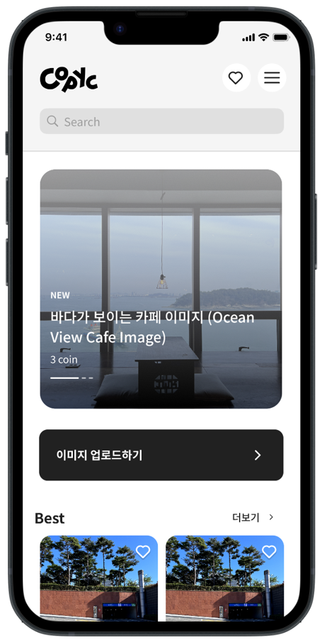
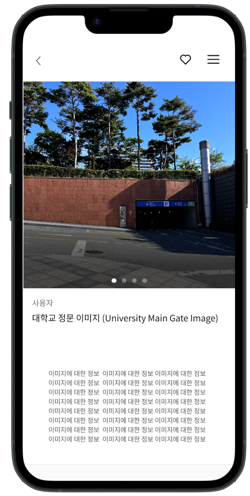
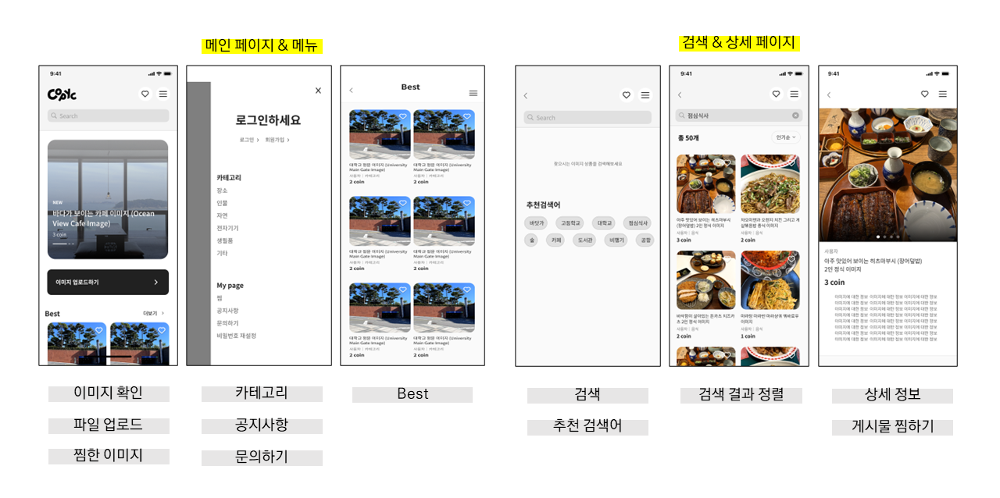
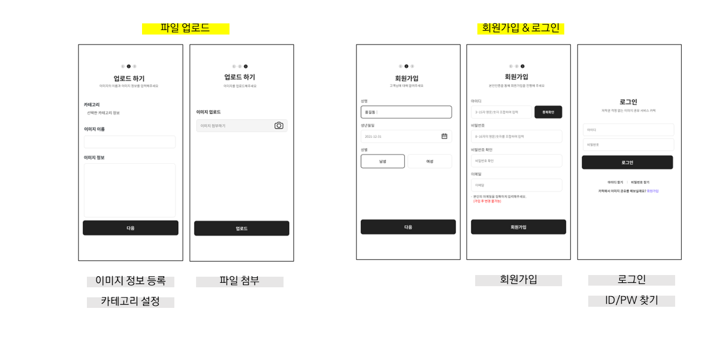

팀페이지 주소 : 2023년 12조 https://kookmin-sw.github.io/capstone-2023-12
<br/>

<div align=center>   
    
</div>
<br/>

<div align=center>
    
    
    
    
    
    
    
    
    
    
    
    
    
</div>
<br/>

## 목차

1. [프로젝트 소개](#프로젝트-소개)
2. [Abstract](#Abstract)
3. [소개 영상](#소개-영상)
4. [팀 소개](#팀-소개)
5. [사용법](#사용법)
6. [상세 기능](#상세-기능)
7. [Document](#Document)


## 1. 프로젝트 소개

**Copyc**
> [카픽] : Copyright + Picture
> 
 

- 웹툰 작가들을 위한 저작권 없는 이미지 공유 모바일 플랫폼
- 저작권 허용, 상업적 이용 OK


웹툰 이용자 1억 8000만 시대.
우리는 웹툰 작가들의 작업 환경을 개선하고자 그들의 작업 방식에 주목했다.
많은 작가들은 배경을 그릴 때 실제 사진을 대고 따라 그리는 '트레이싱' 기법을 사용한다.
그런데 인터넷 속 수많은 사진들, 따라 그리기만 해도 '표절'이란다.

우리는 바쁜 마감 일정 속에서도 어쩔 수 없이 직접 사진을 찍으러 나가야만 하는 작가들의 노동 시간을 단축하고자 한다.
우리가 함께 만들어나갈 Copyc에서는 누구나 상업용으로 쓸 수 있는 직접 찍은 사진들을 공유한다.
항상 우리 주변에 있지만 사진으로는 잘 찍지 않는 길거리, 강의실, 영화관 사진 모두 웹툰 작가들에게는 소중한 자원이다.

서울 한복판에 사는 작가는 여러 건물들의 모습을 공유할 것이다.
해운대 앞에 사는 작가는 바닷가 사진을 공유할 것이다.
제주도에 사는 작가는 제주도 곳곳의 아름다운 풍경들을 공유할 것이다.
Copyc에서 나누게 될 사진들은 누군가에게는 쓸모 없을, 잘 찍었다고 할 수도 없는 사진들이겠지만 웹툰 작가들에게는 그들의 니즈에 꼭 맞는, 무엇보다도 필요했던 자원이 될 것이다.


- 서비스 이용 대상자
    - 웹툰 작가와 지망생, 그 외 일러스트레이터 등 저작권에서 자유로운 사진을 사용하고 싶은 누구나
<br/>

## 2. Abstract

**Copyc**
> Copyright + Picture
- A mobile platform for sharing copyright-free images for webtoon artists that allows for commercial use.
<br/>

In the age of 180 million webtoon users, we have focused on improving the working environment of webtoon artists. Many artists use the 'tracing' technique, where they draw backgrounds by tracing real photos. However, with countless photos available on the internet, simply tracing can lead to accusations of plagiarism.

We aim to reduce the time that busy artists spend taking photos themselves. With Copyc, which we will create together, anyone can share photos they have taken for commercial use. Street scenes, classrooms, and movie theaters that are always around us, but not often photographed, are all valuable resources for webtoon artists.

An artist living in Seoul will share the appearance of various buildings. An artist living in front of Haeundae Beach will share pictures of the beach. An artist living in Jeju Island will share the beautiful scenery of Jeju Island. The photos shared on Copyc may be useless or poorly taken to some people, but they will be valuable resources for webtoon artists.
<br/>

## 3. 소개 영상
프로젝트 데모 Figma 디자인 시연 영상입니다.

시연 영상에서는 **Copyc**에서 제공될 기능들을 미리 확인하실 수 있습니다.

아래 이미지를 클릭하면 유튜브로 연결됩니다.

[](https://youtu.be/vuvmn3MwAls)
<br/>


## 4. 팀 소개

- 정현서

```
* 학번: ****1693
* Role: Team Leader, FrontEnd
* E-mail: coraru@kookmin.ac.kr
```


- 임예도

```
* 학번: ****1682
* Role: BackEnd, Deployment
* E-mail: ydim@kookmin.ac.kr
```
<br/>

## 5. 사용법

배포 이후 추가 예정
<br/>

## 6. 상세 기능
[](https://www.figma.com/file/8diQISW7sASCoCX9au06pY/Untitled?node-id=0%3A1&t=eLfRtNymkIzxVkie-1)

위 아이콘을 눌러 Figma 페이지로 이동하실 수 있습니다.




## 7. Document
**중간 발표**
- [중간보고서](https://drive.google.com/file/d/1AJvlI3NF3VdvhCjl1MGUeuisq3TVIt9F/view?usp=share_link)
- [중간발표자료](https://drive.google.com/file/d/10hzdsp8c0jxI6BGmewgYfPSNsfWUuoh4/view?usp=share_link)
