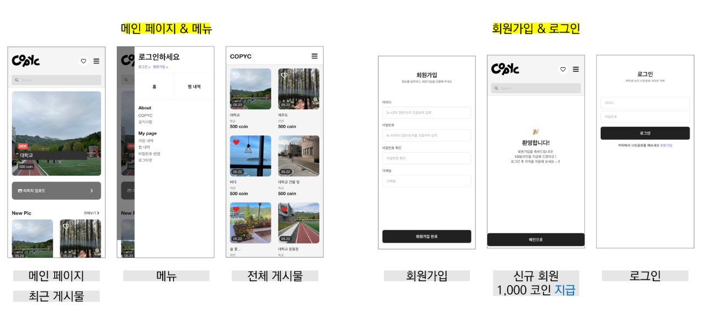
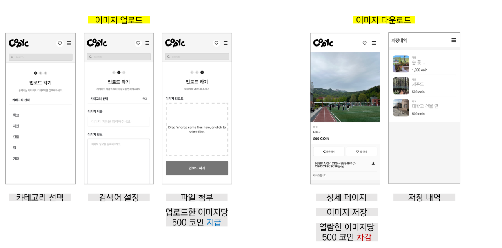
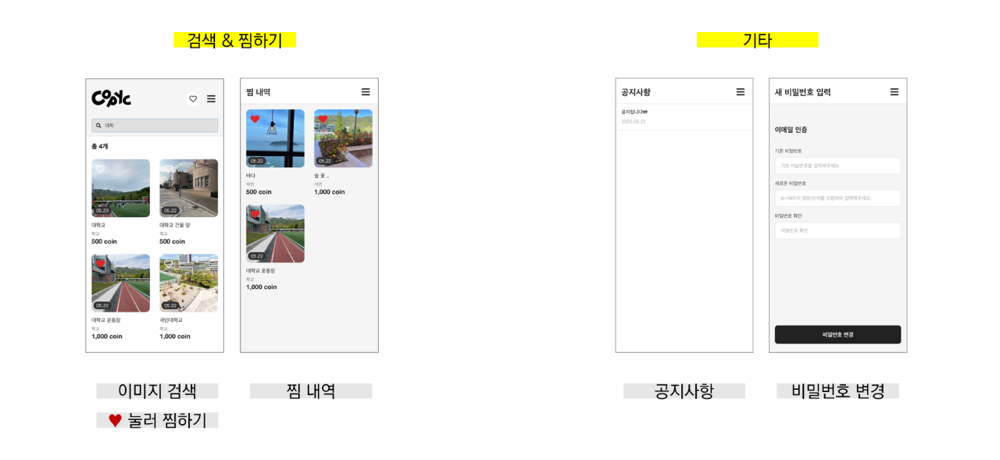

<div align=center>   
    
</div>
<br/>

<div align=center>
    
    
    
    
    
    
    
    
    
    
    
    
    
    
    
    


</div>
<br/>

## 목차

1. [프로젝트 소개](#1-프로젝트-소개)
2. [Abstract](#2-abstract)
3. [시연 영상](#3-시연-영상)
4. [팀 소개](#4-팀-소개)
5. [주요 기능](#5-주요-기능)
6. [시스템 구성도](#6-시스템-구성도)
7. [Document](#7-document)
<br/>

## 1. 프로젝트 소개

**<https://copyc.online>**
> Copyc   
> 카픽 [Copyright + Picture]
 


> - 웹툰 작가들을 위한 이미지 공유 모바일 플랫폼
> - 저작권 허용, 상업적 이용 OK

> *Copyc은 웹툰 작가들을 위한 배경 트레이싱용 이미지 공유 모바일 웹 플랫폼입니다.*   
> *Copyc에서 이미지를 업로드하고 코인을 얻어 원하는 이미지를 다운로드 받으세요!*
<br/>

웹툰 이용자 1억 8,000만 시대.
우리는 웹툰 작가들의 작업 환경을 개선하고자 그들의 작업 방식에 주목했다.
많은 작가는 배경을 그릴 때 실제 사진을 대고 따라 그리는 '트레이싱' 기법을 사용한다.
그런데 인터넷 속 수많은 사진, 따라 그리기만 해도 '표절'이다.

우리는 바쁜 마감 일정 속에서도 어쩔 수 없이 직접 사진을 찍으러 나가야만 하는 작가들의 노동 시간을 단축하고자 한다.
우리가 함께 만들어 나갈 Copyc에서는 누구나 상업용으로 쓸 수 있도록 자신이 직접 찍은 사진들을 공유한다.
항상 우리 주변에 있지만 사진으로는 잘 찍지 않는 길거리, 강의실, 영화관 사진 모두 웹툰 작가들에게는 소중한 자원이다.

서울에 사는 작가는 도심 사진을 공유한다.
부산에 작가는 바닷가 사진을 공유한다.
작가 지망생 학생은 학교 사진을 공유한다.
Copyc에서 나누게 될 누군가에게는 쓸모없을 그 사진들이 웹툰 작가들에게는 무엇보다도 필요했던 자원이다.


- 서비스 이용 대상자
    - 웹툰 작가와 지망생, 그 외 일러스트레이터 등 저작권에서 자유로운 사진을 사용하고 싶은 누구나
<br/>

## 2. Abstract

> Copyc   
> [Copyright + Picture]

> - Image Sharing Mobile Web Platform for Webtoon Writers
> - Copyright allowed, commercial use OK

> *Copyc is a mobile web platform for image sharing, specifically designed for webtoon artists who require background tracing images.   
> With Copyc, you can upload images and earn coins to download the desired images!*   
<br/>

In the era of 180 million webtoon users, we have focused on improving the working environment of webtoon artists by paying attention to their working methods. Many artists use the "tracing" technique, where they refer to actual photographs when drawing backgrounds. However, with countless photos available on the internet, even tracing can be considered as "plagiarism".

In order to shorten the labor time of artists who inevitably have to go out and take photos themselves, even amidst busy deadlines, we aim to share the photos they personally took on Copyc, where anyone can use them for commercial purposes. Street scenes, classrooms, movie theaters—photos of places that are always around us but not often captured can be precious resources for webtoon artists.

An artist living in Seoul will share urban photos.
An artist in Busan will share beach photos.
An aspiring artist student will share school photos.
The photos that may seem useless to someone who will be shared on Copyc will be a valuable resource for webtoon artists above all else.

- Target audience for service:
    - Webtoon artists, aspiring artists, and other illustrators who want to use freely available photos without copyright restrictions.
<br/>

## 3. 시연 영상

[](https://youtu.be/9cNWrtGs6is)
<br/>

## 4. 팀 소개


👸 **정현서**

```
* 학번: ****1693
* Role: Team Leader, FrontEnd
* E-mail: coraru@kookmin.ac.kr
```

🙇 **임예도**

```
* 학번: ****1682
* Role: BackEnd, Infra
* E-mail: ydim@kookmin.ac.kr
```
<br/>

## 5. 주요 기능 


---




<br/>

## 6. 시스템 구성도

<br/>

## 7. Document
**중간 발표**
- [중간보고서](https://drive.google.com/file/d/12mVLmLgrs-cM3martpn90DJj2BWDxbky/view?usp=share_link)
- [중간발표자료](https://drive.google.com/file/d/1F9brloHz6PgaKsG11iMcyqmsTgwyOUM1/view?usp=share_link)
   
**최종 발표**
- [수행결과보고서](https://drive.google.com/file/d/1QPYmrUkeV-sLQE9Sjjhp8fhm5XcEJFd8/view?usp=drive_link)
- [최종발표자료](https://drive.google.com/file/d/1DUOWmquOpQoBKr_06bXS7jzSPqt9EMgR/view?usp=drive_link)
- [포스터](https://drive.google.com/file/d/1DQi_FWJPINpLeSVhU7cidoJar3BHiPct/view?usp=share_link)

**기타**
- [Figma](https://www.figma.com/file/8diQISW7sASCoCX9au06pY/Untitled?type=design)
